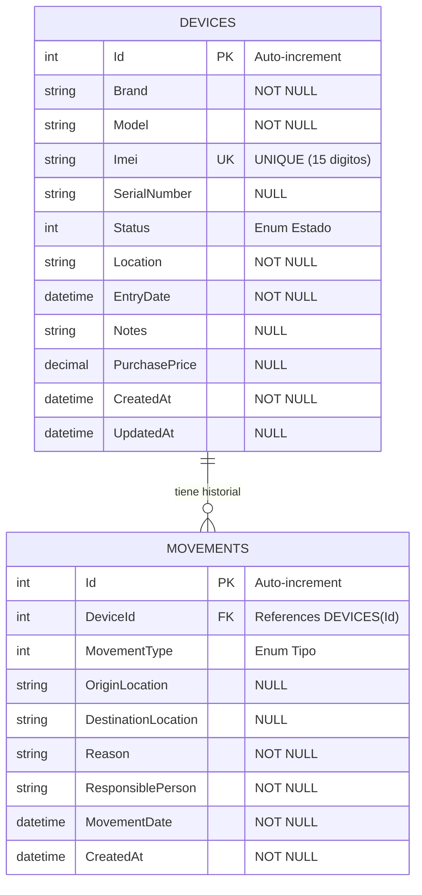
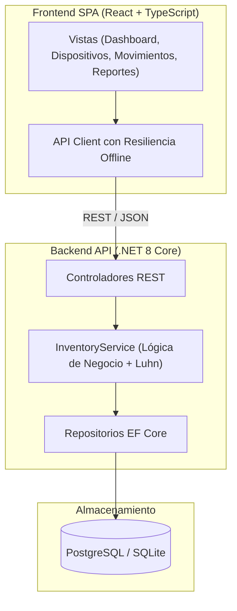

# Plataforma de Gestión e Inventario de Equipos Celulares

[](https://github.com/UPT-FAING-EPIS/si784-2026-ii-si784-2026-ii-examen-u1-usherhalanoccarojas/actions)
[](https://sonarcloud.io/project/overview?id=UPT-FAING-EPIS_si784-2026-ii-si784-2026-ii-examen-u1-usherhalanoccarojas)
[](https://sonarcloud.io/project/overview?id=UPT-FAING-EPIS_si784-2026-ii-si784-2026-ii-examen-u1-usherhalanoccarojas)
[](https://sonarcloud.io/project/overview?id=UPT-FAING-EPIS_si784-2026-ii-si784-2026-ii-examen-u1-usherhalanoccarojas)

Sistema integral para registrar, gestionar y monitorear el inventario de dispositivos móviles, control de stock por ubicación y fabricante, trazabilidad completa de movimientos (Ingreso, Salida, Traslado, Baja) y generación de reportes y analítica en tiempo real.

---

## 📌 Enlaces del Proyecto

| Recurso | Enlace / URL |
| :--- | :--- |
| 🌐 **Aplicación Publicada** | [https://si784-2026-ii-examen-u1-usherhalanoccarojas.vercel.app](https://si784-2026-ii-examen-u1-usherhalanoccarojas.vercel.app) |
| 📁 **Repositorio GitHub** | [https://github.com/UPT-FAING-EPIS/si784-2026-ii-si784-2026-ii-examen-u1-usherhalanoccarojas](https://github.com/UPT-FAING-EPIS/si784-2026-ii-si784-2026-ii-examen-u1-usherhalanoccarojas) |
| 🛡️ **SonarQube / SonarCloud** | [https://sonarcloud.io/project/overview?id=UPT-FAING-EPIS_si784-2026-ii-si784-2026-ii-examen-u1-usherhalanoccarojas](https://sonarcloud.io/project/overview?id=UPT-FAING-EPIS_si784-2026-ii-si784-2026-ii-examen-u1-usherhalanoccarojas) |

---

## 🚀 Características Principales

1. **Catálogo y Registro de Equipos Celulares**:
   - Registro de datos clave: Marca, Modelo, IMEI (15 dígitos numéricos), Número de Serie, Estado, Ubicación, Precio y Notas.
   - **Validación Luhn en Frontend y Backend**: Comprobación matemática en tiempo real del dígito verificador del IMEI para prevenir errores de tipeo o fraude.
2. **Búsqueda y Filtrado Dinámico**:
   - Búsqueda en tiempo real por IMEI, modelo, número de serie o ubicación.
   - Filtros combinados por estado (`Disponible`, `EnUso`, `EnReparacion`, `DeBaja`), marca y sede.
3. **Gestión de Movimientos de Inventario**:
   - Registro de transacciones: `Ingreso`, `Salida`, `Traslado` y `Baja`.
   - Transiciones automáticas de estado y ubicación (ej. Traslado actualiza la ubicación física a la sede destino, Baja retira el equipo de disponibilidad).
   - Historial cronológico con timeline visual por equipo o global.
4. **Reportes y Analítica de Stock**:
   - Métricas y KPIs de existencias y valorización total de activos.
   - Gráficos interactivos de distribución por marca y ubicación.
   - Exportación de datos a formato **CSV** e impresión formateada.
5. **Panel de Usuario (Operador de Tienda/Almacén)**:
   - Interfaz simplificada con simulador de lector de código de barras/IMEI para consultas y despachos express.
6. **Panel de Administración Global**:
   - Auditoría de integridad referencial, estado de salud de la API, copias de seguridad en JSON y reinicialización de datos de prueba.

---

## 🛠️ Stack Tecnológico

- **Backend**: .NET 8 Core Web API, C# 12, Entity Framework Core 8, Inyección de Dependencias, Swagger / OpenAPI.
- **Frontend**: React 19, TypeScript, Vite, Vanilla CSS modular con Glassmorphism y temas adaptativos, Lucide Icons.
- **Base de Datos**: PostgreSQL 16 (producción/contenedor) y SQLite (desarrollo local liviano).
- **Contenedores**: Docker (multi-stage builds de producción con usuarios no-root) y Docker Compose.
- **Infraestructura como Código (IaC)**: Terraform (AWS App Runner / VPC / RDS PostgreSQL / S3).
- **CI/CD & DevSecOps**:
  - `infra.yml`: Aprovisionamiento de infraestructura en la nube con Terraform.
  - `sonar.yml`: Escaneo de calidad de código y Quality Gate en SonarCloud.
  - `snyk-semgrep.yml`: Análisis estático SAST con Semgrep y escaneo de vulnerabilidades/contenedores con Snyk.
  - `deploy.yml`: Compilación, pruebas, empaquetado Docker en GitHub Container Registry y despliegue continuo.
  - `generate-documentation.yml`: Generación automatizada de diagramas Mermaid y diccionario de datos.

---

## 📡 Endpoints de la API RESTful

| Método | Endpoint | Descripción | Códigos HTTP |
| :--- | :--- | :--- | :--- |
| `GET` | `/devices` | Listar equipos celulares con filtros (`search`, `status`, `location`, `brand`) | 200 OK |
| `POST` | `/devices` | Registrar nuevo equipo celular (valida IMEI con algoritmo Luhn) | 201 Created, 400, 409 |
| `GET` | `/devices/{id}` | Obtener detalle de un equipo celular por ID | 200 OK, 404 |
| `PUT` | `/devices/{id}` | Actualizar datos de un equipo celular | 200 OK, 400, 404, 409 |
| `DELETE` | `/devices/{id}` | Eliminar equipo celular y su historial en cascada | 204 No Content, 404 |
| `GET` | `/movements` | Listar movimientos (`?deviceId={id}` filtra por equipo celular) | 200 OK |
| `POST` | `/movements` | Registrar movimiento (Ingreso, Salida, Traslado, Baja) y actualizar estado | 201 Created, 400, 404 |
| `GET` | `/movements/{id}` | Obtener detalle de un movimiento específico | 200 OK, 404 |
| `GET` | `/reports/stock` | Reporte consolidado de stock por ubicación, marca y estado | 200 OK |
| `GET` | `/reports/summary` | Resumen general con KPIs ejecutivos y últimos eventos | 200 OK |
| `GET` | `/health` | Chequeo de salud del servicio para orquestadores y balanceadores | 200 OK |

---

## 🏗️ Arquitectura y Diagramas Mermaid

### 1. Diagrama Entidad-Relación (ER)


### 2. Diagrama de Componentes


*(Consulte la documentación completa en [docs/ARCHITECTURE.md](docs/ARCHITECTURE.md) y el diccionario de campos en [docs/data-dictionary.md](docs/data-dictionary.md)).*

---

## 💻 Guía de Ejecución Local

### Opción 1: Ejecutar con Docker Compose (Recomendado)
Levanta la base de datos PostgreSQL, el backend .NET 8 y el frontend React con un solo comando:
```bash
docker-compose up --build
```
- **Frontend**: [http://localhost:3000](http://localhost:3000)
- **Backend API**: [http://localhost:5000](http://localhost:5000)
- **Documentación Swagger**: [http://localhost:5000/swagger](http://localhost:5000/swagger)

---

### Opción 2: Ejecución Nativa Manual

#### 1. Backend (.NET 8)
```bash
cd backend/src/DeviceInventory.Api
dotnet run
```
La API iniciará en `http://localhost:5000` con base de datos SQLite preconfigurada y datos iniciales listos para prueba.

#### 2. Frontend (React + Vite)
```bash
cd frontend
npm install
npm run dev
```
La aplicación web estará accesible en `http://localhost:5173`.

---

## 🧪 Ejecución de Pruebas Unitarias e Integración

El proyecto incluye 28 pruebas automatizadas que validan:
- Algoritmo de verificación Luhn para IMEIs válidos e inválidos.
- Lógica de negocio y transiciones de estado en `InventoryService`.
- Respuestas HTTP y códigos de estado en los controladores REST.
- Ciclo de vida completo del dispositivo y movimientos con base de datos en memoria.

Para ejecutar todas las pruebas:
```bash
dotnet test backend/DeviceInventory.sln
```

---

## 🛡️ Flujos de Automatización CI/CD

Los workflows configurados en `.github/workflows/` comprenden:
- **`infra.yml`**: Inicializa, valida, planifica y aplica la infraestructura en la nube con Terraform.
- **`sonar.yml`**: Compila con recolección de cobertura de código, analiza y valida el Quality Gate en SonarCloud.
- **`snyk-semgrep.yml`**: Analiza vulnerabilidades de código fuente (SAST) y seguridad del contenedor Docker.
- **`deploy.yml`**: Compila, ejecuta pruebas, construye imágenes multi-stage y las publica en GitHub Container Registry.
- **`generate-documentation.yml`**: Genera y actualiza automáticamente los diagramas Mermaid y el diccionario de datos.
