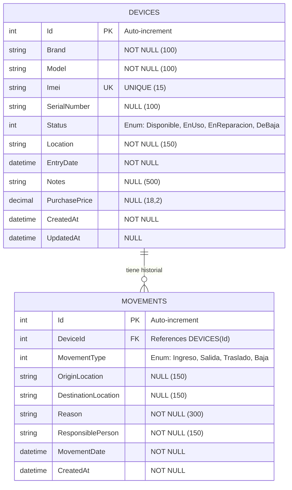
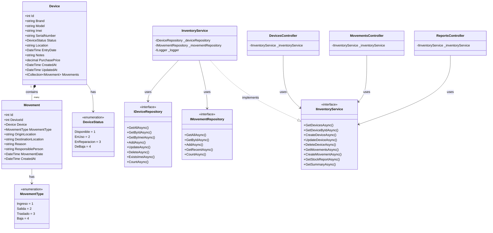
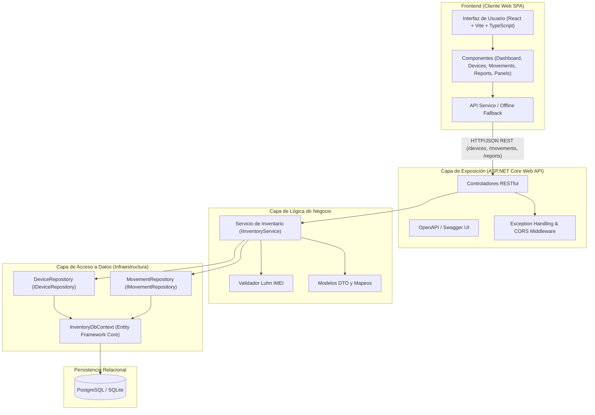
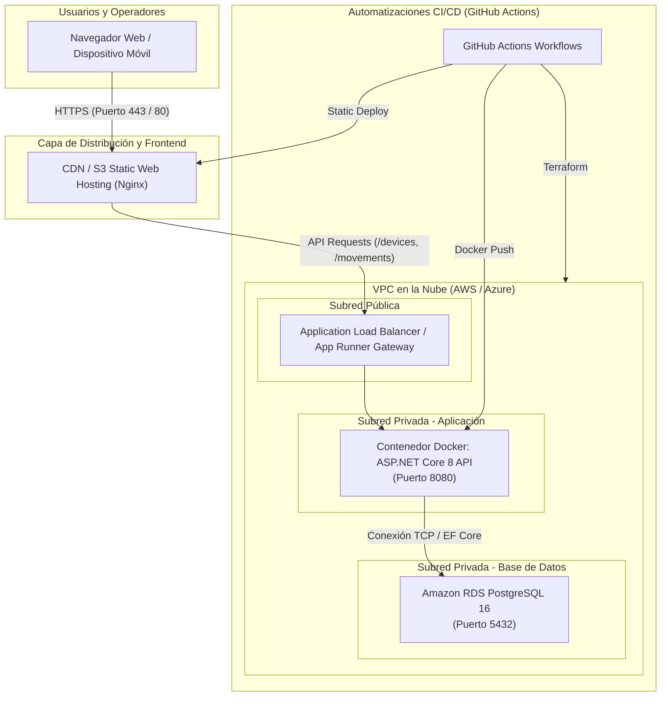

# Documento de Arquitectura y Diseño Técnico

Este documento consolida la arquitectura del sistema, el diccionario de datos y los diagramas estructurales y de despliegue generados en formato **Mermaid**.

---

## 1. Diagrama Entidad-Relación (ER)
Representa el modelo relacional implementado en la base de datos PostgreSQL / SQLite.

---

## 2. Diagrama de Clases
Muestra el diseño orientado a objetos en .NET Core siguiendo principios SOLID y arquitectura en capas.

---

## 3. Diagrama de Componentes
Ilustra la separación de responsabilidades entre el frontend, controladores API, servicios de dominio, acceso a datos y almacenamiento.

---

## 4. Diagrama de Despliegue
Detalla la infraestructura de ejecución contenerizada y aprovisionamiento en la nube mediante Terraform.

